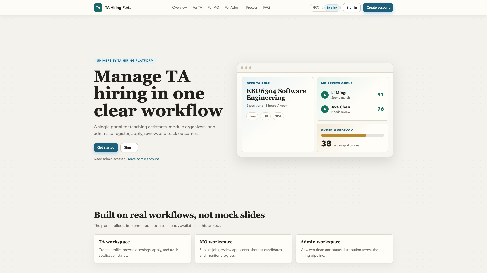
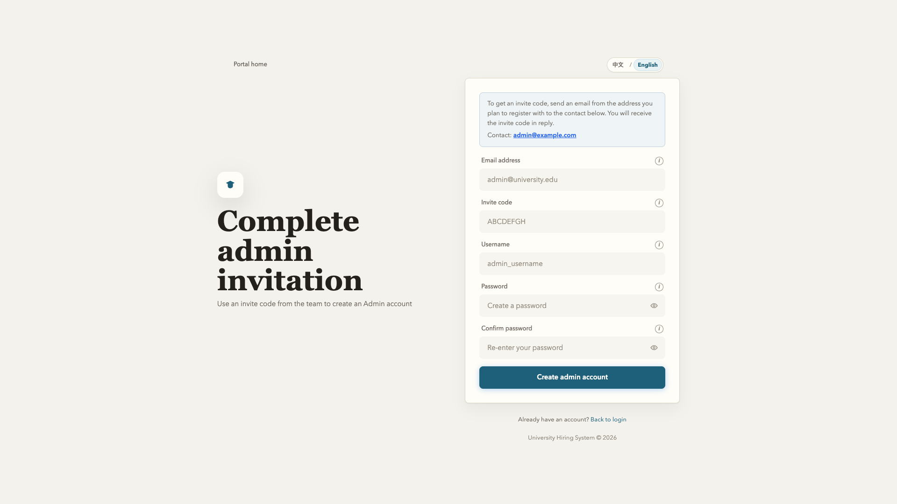
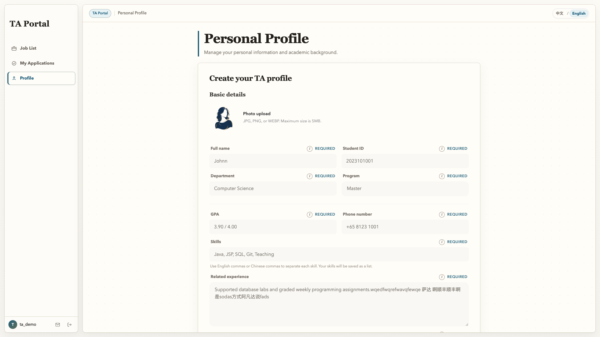
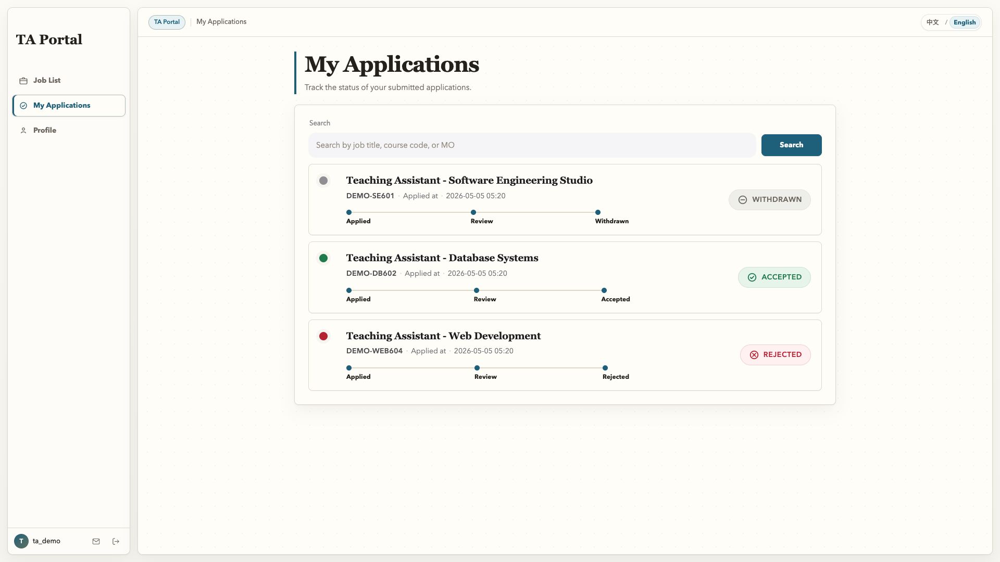
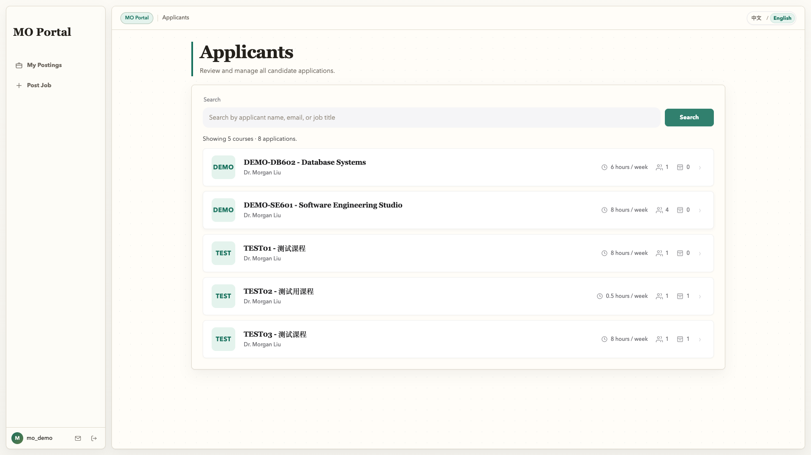
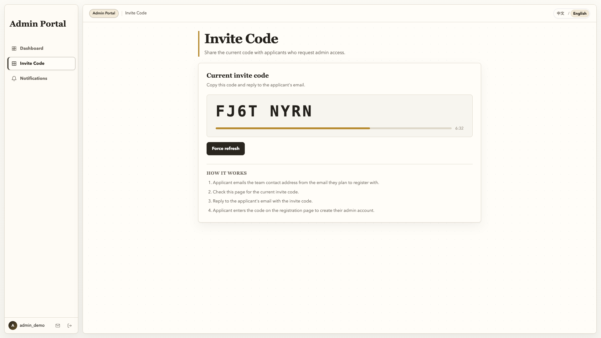
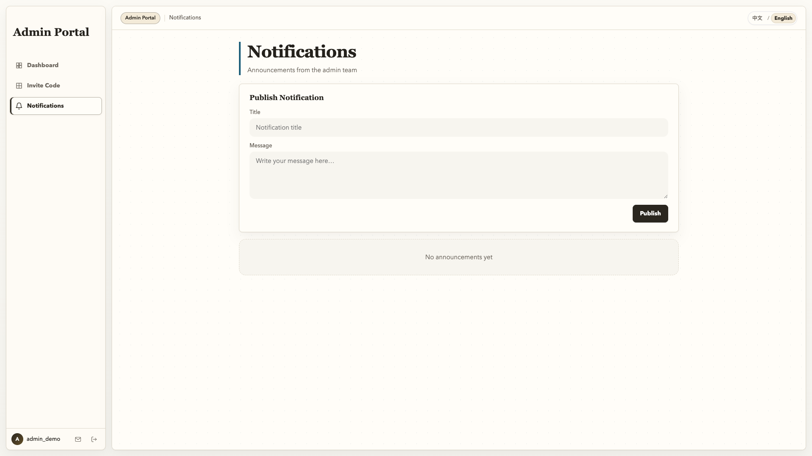

# TA Hiring System 用户手册

## 1. 文档说明

本手册面向 TA、MO 和管理员三类用户，说明如何访问系统、注册和登录账号，以及如何完成各角色的主要操作。

系统名称统一为 **TA Hiring System**。本地演示环境默认访问地址为：

```text
http://localhost:8080/groupproject/
```

如果本机 Tomcat 端口或应用名不同，请以本地 `scripts/config.sh` 或 `scripts/config.bat` 中的实际配置为准。

## 2. 公共入口与账号

### 2.1 门户首页

门户首页提供系统概览、角色入口、登录入口和注册入口。用户可以从右上角切换语言，也可以直接进入登录或注册页面。



### 2.2 登录页面

登录时需要填写用户名或邮箱、密码，并选择对应角色。账号角色和登录角色必须一致，否则系统会拒绝登录。


### 2.3 TA/MO 注册页面

普通注册页面用于创建 TA 或 MO 账号。注册时需要填写用户名、邮箱、密码，并选择 TA 或 MO 角色。


### 2.4 管理员邀请注册页面

管理员账号不从普通注册入口创建。新管理员需要先获得当前 8 位邀请码，再在管理员邀请注册页填写邮箱、邀请码、用户名和密码。



### 2.5 演示账号

本地演示环境启动时会自动补齐固定演示账号和示例数据。常用账号如下：

| 角色 | 用户名 | 密码 |
| ---- | ------ | ---- |
| TA | `ta_demo` | `Pass1234` |
| MO | `mo_demo` | `Pass1234` |
| 管理员 | `admin_demo` | `Pass1234` |

如果页面没有显示演示数据，请确认应用已经通过项目脚本重新部署，并且本次运行使用了正确的 `TA_HIRING_DATA_DIR`。

## 3. TA 使用指南

TA 用户主要完成个人资料维护、岗位浏览、岗位申请和申请状态跟踪。

### 3.1 TA 个人资料

进入 TA 后，系统会显示个人资料页面。TA 可以维护姓名、学号、院系、项目类型、GPA、联系方式、技能、相关经历、申请动机、头像和简历。



操作要点：

- 头像支持 JPG、PNG、WEBP，最大 5MB。
- 简历支持 PDF、DOC、DOCX，最大 10MB。
- 技能建议使用英文逗号或中文逗号分隔。
- 保存资料后，MO 在审核申请时可以查看相关信息。

### 3.2 TA 岗位列表

岗位列表展示当前系统中的 TA 岗位。TA 可以通过搜索框按岗位标题、课程代码或关键词筛选，也可以进入岗位详情页查看岗位要求。


操作要点：

- 岗位卡片会显示课程代码、课程名称、MO、截止时间、薪资、工作量和所需技能。
- 进入岗位详情后，可以填写求职说明并提交申请。
- 已关闭或已招满的岗位仍可能出现在列表中，但不能继续作为开放申请处理。

### 3.3 TA 申请状态

申请状态页展示 TA 已提交的申请记录，并通过时间线显示申请进度。



常见状态包括：

| 状态 | 含义 |
| ---- | ---- |
| `PENDING` | 已提交，等待 MO 审核 |
| `ACCEPTED` | MO 已接受申请 |
| `REJECTED` | MO 已拒绝申请 |
| `WITHDRAWN` | TA 已撤回申请 |

## 4. MO 使用指南

MO 用户主要完成岗位发布、岗位维护、申请人查看、申请人 AI 推荐和申请详情 AI 分析。

### 4.1 MO 岗位管理

MO 登录后默认进入岗位管理页面，可以查看自己发布的岗位，也可以切换到发布岗位表单。


发布岗位时通常需要填写：

- 岗位标题、课程代码、课程名称；
- 岗位描述和所需技能；
- 招聘人数、截止日期、每周工作小时数；
- 工作开始日期、工作结束日期和薪资说明。

### 4.2 MO 申请人审核子视图

申请人审核现在集成在 MO 岗位管理页中。MO 从“我的发布”进入某个岗位后，可以查看该岗位收到的申请，并按申请人姓名、邮箱或岗位标题搜索。



操作要点：

- 有申请记录时，页面会显示申请人卡片。
- MO 可以查看申请人信息、申请岗位和求职说明。
- 对待审核申请，MO 可以执行接受或拒绝操作。

### 4.3 MO AI 推荐

MO 岗位管理页可以使用 AI 推荐搜索候选人。

页面会展示：

- AI 推荐的候选人列表；
- 推荐理由和候选人基础信息；
- 可继续进入申请人详情查看材料并处理申请。

如果 AI 配置不可用，页面会显示不可用提示，不生成本地假推荐。

## 5. 管理员使用指南

管理员主要负责查看 TA 工作量、管理管理员邀请码和发布通知。

### 5.1 TA 工作量仪表盘

管理员仪表盘展示已接受岗位带来的 TA 工作量统计。页面支持按 TA 姓名或相关关键词搜索。


页面重点信息包括：

- 已纳入统计的 TA；
- 每位 TA 的已接受岗位数；
- 每位 TA 的累计工作小时数；
- 点击卡片后可展开查看具体岗位工作量。

### 5.2 管理员邀请码管理

邀请码管理页展示当前可用的 8 位管理员邀请码和倒计时。管理员可以把当前邀请码回复给需要创建管理员账号的申请人。



操作流程：

1. 申请人使用计划注册的邮箱联系团队。
2. 管理员进入邀请码管理页查看当前邀请码。
3. 管理员把邀请码回复给申请人。
4. 申请人在管理员邀请注册页完成账号创建。

### 5.3 管理员通知页面

通知页面用于发布面向系统用户的公告。管理员可以填写通知标题和正文并发布。



发布前建议确认：

- 标题简洁明确；
- 正文包含具体事项、对象和时间；
- 不在公告中填写不必要的个人敏感信息。

## 6. 常见问题

### 6.1 登录失败

- 确认用户名或邮箱填写正确。
- 确认密码正确。
- 确认登录页面选择的角色与账号角色一致。
- 如果使用演示账号失败，请重启或重新部署本地应用，确认演示数据已初始化。

### 6.2 TA 无法上传头像或简历

- 检查文件格式是否符合页面提示。
- 检查文件大小是否超过限制。
- 检查当前会话是否过期，必要时重新登录。

### 6.3 MO 看不到申请人

- 确认 TA 已经对该 MO 发布的岗位提交申请。
- 确认当前登录账号是岗位所属 MO。
- 可以先查看岗位管理页，确认岗位是否存在。

### 6.4 AI 推荐或分析不可用

- 确认 AI 配置文件中的 API Key、模型和网络访问可用。
- 确认当前岗位、申请或 TA 档案数据完整。
- 如果 AI 服务暂不可用，页面会显示失败提示，不生成本地普通匹配结果。

### 6.5 管理员看不到工作量

- 确认当前账号以管理员角色登录。
- 确认系统中存在已接受的 TA 申请。
- 确认岗位有有效的每周小时数和工作周期数据。

## 7. 截图索引

本手册中的截图均保存在当前 Markdown 文件同级目录下的 `user-manual-images/` 中。

| 文件名 | 对应页面 | 说明 |
| ------ | -------- | ---- |
| `home.png` | `/` | 门户首页 |
| `login.png` | `/login.jsp` | 登录页面 |
| `register.png` | `/register.jsp` | TA/MO 注册页面 |
| `admin-invite-register.png` | `/admin-invite.jsp` | 管理员邀请注册页面 |
| `ta-dashboard.png` | `/jsp/ta/dashboard.jsp` | TA 个人资料页面 |
| `ta-job-list.png` | `/jsp/ta/job-list.jsp` | TA 岗位列表 |
| `ta-application-status.png` | `/jsp/ta/application-status.jsp` | TA 申请状态 |
| `mo-dashboard.png` | `/jsp/mo/dashboard.jsp` | MO 岗位管理 |
| `mo-dashboard-applicants.png` | `/jsp/mo/dashboard.jsp` | MO 申请人审核子视图 |
| `admin-dashboard.png` | `/jsp/admin/dashboard.jsp` | 管理员 TA 工作量 |
| `admin-invite-management.png` | `/jsp/admin/invite.jsp` | 管理员邀请码管理 |
| `admin-notifications.png` | `/jsp/admin/notifications.jsp` | 管理员通知页面 |

## 8. 维护建议

- 每次新增主要页面后，在本手册中补充操作说明和截图。
- 每次调整路由、角色权限或演示账号后，同步更新“公共入口与账号”章节。
- 每次调整 Admin、MO 或 TA 的核心页面后，重新采集对应截图，避免手册内容与实际界面不一致。
